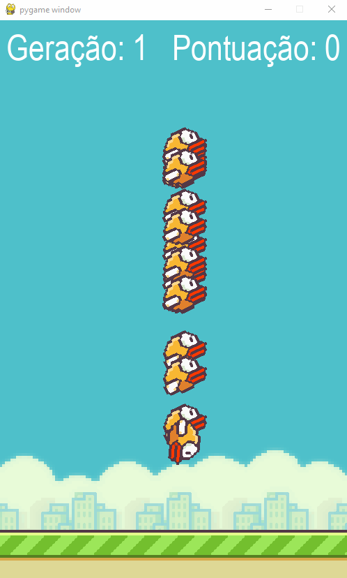

# FlappyBird - Pyhton

## Screenshots

## Project using pyhton whit:
* Pygame
* NEAT

## How to use:
* Install pygame library  --> **pip install pygame**
* Install neat library --> **pip install neat-python**
* Run FlappyBirdIA.py

